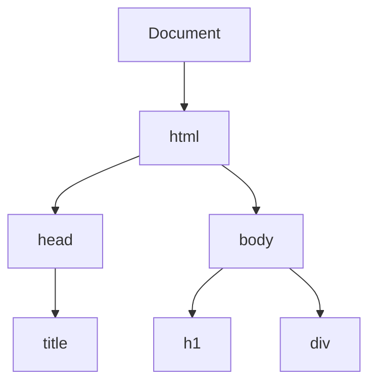

# Événements JavaScript et Manipulation du DOM
## Construire des applications web interactives

---
layout: two-cols
---

# Ce Que Nous Allons Couvrir

<div class="text-left">

- JavaScript et le DOM
- Comprendre les Événements
- Gestion des Événements
- Propagation des Événements
- Événements DOM Courants
- Manipulation du DOM
- Exemples Pratiques
- Bonnes Pratiques

</div>

::right::

<div class="flex justify-center h-full items-center">
  <div class="w-40 h-40 bg-yellow-300 rounded-lg shadow-xl flex items-center justify-center transform hover:rotate-45 transition-transform duration-500 cursor-pointer">
    <span class="text-xl font-bold">Survolez-moi !</span>
  </div>
</div>

---

# HTML DOM

Lorsqu'une page web est chargée, le navigateur crée DOM (Document Object Model) de la page

<div class="flex justify-center items-center">

</div>

---

## JavaScript obtient toute la puissance nécessaire pour créer du HTML dynamique:

<ul class="list-disc pl-6 space-y-2 text-lg">
  <li class="text-gray-200 hover:text-blue-600 transition-colors">JavaScript peut modifier tous les éléments HTML de la page</li>
  <li class="text-gray-200 hover:text-blue-600 transition-colors">JavaScript peut modifier tous les attributs HTML de la page</li>
  <li class="text-gray-200 hover:text-blue-600 transition-colors">JavaScript peut modifier tous les styles CSS de la page</li>
  <li class="text-gray-200 hover:text-blue-600 transition-colors">JavaScript peut supprimer des éléments et des attributs HTML existants</li>
  <li class="text-gray-200 hover:text-blue-600 transition-colors">JavaScript peut ajouter de nouveaux éléments et attributs HTML</li>
  <li class="text-gray-200 hover:text-blue-600 transition-colors">JavaScript peut réagir à tous les événements HTML existants dans la page</li>
  <li class="text-gray-200 hover:text-blue-600 transition-colors">JavaScript peut créer de nouveaux événements HTML dans la page</li>
</ul>

---

# Trouver des Éléments HTML

<div class="grid grid-cols-2 gap-4">
  <div>
    <h3 class="text-yellow-500 text-xl mb-2">Méthodes de Sélection</h3>
    
```js
// Par ID - retourne un élément unique
const element = document.getElementById('monId');

// Par nom de classe - retourne une HTMLCollection
const elements = document.getElementsByClassName('maClasse');

// Par nom de balise - retourne une HTMLCollection
const paragraphes = document.getElementsByTagName('p');

// Par nom - retourne une NodeList (formulaires)
const inputs = document.getElementsByName('email');
```
  </div>
  
  <div>
    <h3 class="text-yellow-500 text-xl mb-2">Sélecteurs CSS (Modernes)</h3>
    
```js
// Sélectionne le premier élément correspondant
const premier = document.querySelector('.classe');

// Sélectionne tous les éléments correspondants
// Retourne une NodeList
const tous = document.querySelectorAll('p.important');

// Sélecteurs complexes
const elements = document.querySelectorAll(
  'div.container > p:first-child'
);

// Vérifier l'existence d'un élément
if (document.querySelector('.elementSpecial')) {
  // L'élément existe
}
```
  </div>
</div>

---

# Collections HTML et NodeList

<div class="grid grid-cols-2 gap-4">
  <div>
    <h3 class="text-yellow-500 text-xl mb-2">HTMLCollection</h3>
    
```js
// Retourne une HTMLCollection
const divs = document.getElementsByTagName('div');

// Accès par index
const premierDiv = divs[0];

// Accès par ID
const divSpecial = divs.namedItem('divId');

// ⚠️ Collection DYNAMIQUE (mise à jour automatique)
// quand le DOM change
console.log(divs.length); // 5
document.body.appendChild(document.createElement('div'));
console.log(divs.length); // 6 (mise à jour automatique)

// Conversion en tableau pour utiliser les méthodes Array
const tabDivs = Array.from(divs);
tabDivs.forEach(div => div.style.color = 'blue');
```
  </div>
  
  <div>
    <h3 class="text-yellow-500 text-xl mb-2">NodeList</h3>
    
```js
// Retourne une NodeList
const paras = document.querySelectorAll('p');

// Accès par index
const premierPara = paras[0];

// ⚠️ Collection STATIQUE (pas de mise à jour)
console.log(paras.length); // 3
document.body.appendChild(document.createElement('p'));
console.log(paras.length); // Toujours 3 (ne change pas)

// Possède forEach natif (mais pas toutes les méthodes Array)
paras.forEach(para => para.classList.add('texte'));

// Conversion complète en tableau si nécessaire
const tabParas = Array.from(paras);
const filtre = tabParas.filter(p => p.textContent.includes('mot'));
```
  </div>
</div>

---

# Modifier des Éléments HTML

<div class="grid grid-cols-2 gap-4">
  <div>
    <h3 class="text-yellow-500 text-xl mb-2">Contenu et Attributs</h3>
    
```js
// Modifier le contenu HTML
element.innerHTML = '<span>Nouveau contenu</span>';

// Modifier le contenu texte (plus sécurisé)
element.textContent = 'Texte simple';

// Modifier des attributs (méthode 1)
element.setAttribute('class', 'active');
element.setAttribute('data-id', '123');

// Modifier des attributs (méthode 2)
element.id = 'nouveauId';
element.className = 'nouvelle-classe';
element.href = 'https://exemple.com';
```
  </div>
  
  <div>
    <h3 class="text-yellow-500 text-xl mb-2">Styles et Classes</h3>
    
```js
// Modifier les styles directement
element.style.color = 'red';
element.style.backgroundColor = '#f0f0f0';
element.style.fontSize = '18px';

// Ajouter/supprimer des classes
element.classList.add('actif');
element.classList.remove('inactif');
element.classList.toggle('selectionne');
element.classList.replace('ancien', 'nouveau');

// Vérifier si une classe existe
if (element.classList.contains('important')) {
  // Faire quelque chose
}
```
  </div>
</div>

---

# Ajouter et Supprimer des Éléments

<div class="grid grid-cols-2 gap-4">
  <div>
    <h3 class="text-yellow-500 text-xl mb-2">Créer et Ajouter</h3>
    
```js
// Créer un nouvel élément
const div = document.createElement('div');
const para = document.createElement('p');

// Ajouter à la fin d'un élément parent
document.body.appendChild(div);
parentElement.appendChild(para);

// Insérer avant un élément spécifique
parentElement.insertBefore(nouvelElement, referenceElement);

// Méthodes modernes (meilleur support)
parent.append(element1, element2); // Ajoute à la fin
parent.prepend(element); // Ajoute au début
reference.before(element); // Insère avant
reference.after(element); // Insère après
```
  </div>
  
  <div>
    <h3 class="text-yellow-500 text-xl mb-2">Supprimer et Remplacer</h3>
    
```js
// Supprimer un élément (méthode moderne)
element.remove();

// Supprimer un élément enfant
parent.removeChild(element);

// Remplacer un élément
parent.replaceChild(nouvelElement, ancienElement);

// Méthode moderne pour remplacer
ancienElement.replaceWith(nouvelElement);

// Écrire directement dans le flux HTML (DÉCONSEILLÉ)
// Efface tout le contenu existant !
document.write('<p>Nouveau contenu</p>');
```
</div>
</div>

---

# De la Manipulation du DOM aux Événements

<div class="flex flex-col items-center justify-center h-80">
  <div class="text-5xl font-bold mb-8 bg-gradient-to-r from-blue-400 to-purple-500 text-transparent bg-clip-text">
    Structure ⟹ Interaction
  </div>
  <div class="grid grid-cols-2 gap-8">
    <div class="flex flex-col items-center">
      <div class="text-6xl mb-4">🏗️</div>
      <div class="text-center">
        <div class="text-xl font-semibold text-blue-400">Manipulation du DOM</div>
        <div class="text-sm text-gray-400 mt-2">Création et modification d'éléments</div>
      </div>
    </div>
    <div class="flex flex-col items-center">
      <div class="text-6xl mb-4">🖱️</div>
      <div class="text-center">
        <div class="text-xl font-semibold text-purple-500">Événements</div>
        <div class="text-sm text-gray-400 mt-2">Interactivité et réponse aux actions</div>
      </div>
    </div>
  </div>
</div>

---

# Événements HTML Courants

<div class="grid grid-cols-3 gap-4">
  <div>
    <h3 class="text-yellow-500 text-xl mb-2">Événements Souris</h3>
    <ul class="space-y-1 text-sm">
      <li><code>onclick</code> - Clic sur l'élément</li>
      <li><code>ondblclick</code> - Double clic</li>
      <li><code>onmouseover</code> - Souris entre dans l'élément</li>
      <li><code>onmouseout</code> - Souris quitte l'élément</li>
      <li><code>onmousedown</code> - Bouton souris enfoncé</li>
      <li><code>onmouseup</code> - Bouton souris relâché</li>
      <li><code>onmousemove</code> - Souris déplacée sur élément</li>
      <li><code>oncontextmenu</code> - Clic droit (menu contextuel)</li>
    </ul>
  </div>
  
  <div>
    <h3 class="text-yellow-500 text-xl mb-2">Formulaires & Clavier</h3>
    <ul class="space-y-1 text-sm">
      <li><code>onsubmit</code> - Formulaire soumis</li>
      <li><code>onreset</code> - Formulaire réinitialisé</li>
      <li><code>onfocus</code> - Élément reçoit le focus</li>
      <li><code>onblur</code> - Élément perd le focus</li>
      <li><code>onchange</code> - Valeur du champ changée</li>
      <li><code>oninput</code> - Saisie dans champ de texte</li>
      <li><code>onkeydown</code> - Touche enfoncée</li>
      <li><code>onkeyup</code> - Touche relâchée</li>
      <li><code>onkeypress</code> - Touche pressée (caractère)</li>
      <li><code>onselect</code> - Texte sélectionné</li>
    </ul>
  </div>
  
  <div>
  <div>
    <h3 class="text-yellow-500 text-xl mb-2">Document & Ressources</h3>
    <ul class="space-y-1 text-sm">
      <li><code>onload</code> - Élément chargé</li>
      <li><code>onunload</code> - Page déchargée</li>
      <li><code>onresize</code> - Fenêtre redimensionnée</li>
      <li><code>onscroll</code> - Défilement de la page</li>
      <li><code>onerror</code> - Erreur de chargement</li>
      <li><code>onabort</code> - Chargement interrompu</li>
      <li><code>onbeforeunload</code> - Avant déchargement</li>
    </ul>
    
  </div>
  <div>
    <h3 class="text-yellow-500 text-xl mb-2 mt-3">Tactile</h3>
    <ul class="space-y-1 text-sm">
      <li><code>ontouchstart</code> - Début toucher</li>
      <li><code>ontouchend</code> - Fin toucher</li>
      <li><code>ontouchmove</code> - Mouvement tactile</li>
    </ul>
  </div>
  </div>
</div>

<div class="mt-4 p-3 rounded-lg text-center text-sm">
  <span class="font-bold">Note:</span> Tous ces événements peuvent être utilisés comme attributs HTML (onclick="...") 
  <br>ou attachés via JavaScript avec addEventListener('click', ...)
</div>

---

# Méthodes de Gestion des Événements

<div class="grid grid-cols-2 gap-4">
  <div>
    <h3 class="text-xl text-yellow-500 mb-2">Méthode 1 : Attributs HTML</h3>
```html
<button onclick="gererClic()">Cliquez-moi</button>
```
    <div class="mt-2 text-red-500">⚠️ Non recommandé - mélange HTML et JS</div>
  </div>
  <div>
    <h3 class="text-xl text-yellow-500 mb-2">Méthode 2 : Propriétés DOM</h3>
```js
const bouton = document.querySelector('button');
bouton.onclick = function() {
  alert('Bouton cliqué !');
};
```
    <div class="mt-2 text-orange-500">⚠️ Limité - un seul gestionnaire par événement</div>
  </div>
</div>

<div class="mt-6">
  <h3 class="text-xl text-yellow-500 mb-2">Méthode 3 : addEventListener (Recommandée)</h3>
```js
const bouton = document.querySelector('button');
bouton.addEventListener('click', function() {
  alert('Premier gestionnaire');
});
bouton.addEventListener('click', function() {
  alert('Deuxième gestionnaire');
});
```
  <div class="mt-2 text-green-500">✓ Gestionnaires multiples, plus de contrôle, séparation plus propre</div>
</div>

---

# Techniques Avancées d'Événements

<div class="grid grid-cols-2 gap-4">
  <div>
    <h3 class="text-xl text-yellow-500 mb-2">Délégation d'Événements</h3>
```js
// Au lieu d'ajouter un écouteur à chaque bouton
document.getElementById('container').addEventListener('click', function(e) {
  // Vérifier si l'élément cliqué est un bouton
  if (e.target.matches('button.action')) {
    console.log('Bouton cliqué:', e.target.textContent);
    // Traiter l'événement
  }
});
```
    <div class="mt-2 text-green-500">✓ Parfait pour les éléments dynamiques</div>
    <h3 class="text-xl text-yellow-500 mb-4 mt-4">Supprimer des Écouteurs</h3>

```js
function handleClick(e) {
  console.log('Clic traité');
  // Supprimer après la première utilisation
  e.currentTarget.removeEventListener('click', handleClick);
}

element.addEventListener('click', handleClick);
```
  </div>
  
  <div>
    <h3 class="text-xl text-yellow-500 mb-2">Options de addEventListener</h3>

```js
// Options de base
element.addEventListener('click', handler, {
  once: true,      // Se déclenche une seule fois puis se supprime
  capture: true,   // Capture pendant la phase descendante
  passive: true    // Indique que preventDefault() ne sera pas appelé
});

// Arrêter la propagation
element.addEventListener('click', function(e) {
  e.stopPropagation(); // Empêche la remontée aux parents
});

// Empêcher le comportement par défaut
form.addEventListener('submit', function(e) {
  e.preventDefault(); // Empêche l'envoi du formulaire
  // Validation ou soumission AJAX
});
```
    <div class="mt-2 text-blue-500">ℹ️ L'option 'passive' améliore les performances tactiles</div>
  </div>
</div>

---
layout: two-cols
---

# Mouse Hover

<div class="flex h-full items-center justify-center">
  <div id="mouse" class="flex justify-center items-center border-2 border-blue-400 rounded-lg w-72 h-72 bg-gray-800 text-blue-300 font-mono text-xl shadow-lg transition-all duration-300 hover:border-blue-500 hover:shadow-blue-400/30">
    Déplacez le curseur ici
  </div>
</div>

::right::

<div class="flex flex-col h-full justify-center pl-4">
  <h3 class="text-yellow-500 text-xl mb-4">Code</h3>
  
```js
const mouse = document.getElementById("mouse");

mouse.addEventListener("mousemove", (e) => {
  // Récupérer les coordonnées de la souris
  const x = e.clientX;
  const y = e.clientY;
  
  mouse.textContent = `(${x}, ${y})`;
  
  // Utiliser HSL pour une transition fluide des couleurs
  const hue = (x % 360);
  const saturation = Math.min(100, (y / window.innerHeight) * 100);
  const lightness = 20 + Math.sin(x * 0.01) * 10;
  mouse.style.backgroundColor = `hsl(${hue}, ${saturation}%, ${lightness}%)`;
});
```
</div>

<script setup>
import { onMounted } from 'vue'

onMounted(() => {
  const mouse = document.getElementById("mouse")
  mouse.addEventListener("mousemove",(e)=>{
    mouse.textContent = `(${e.clientX}, ${e.clientY})`
    const hue = (e.clientX % 360);
    mouse.style.backgroundColor = `hsl(${hue}, 70%, 20%)`;
  })
})
</script>

---

# Démo : Écouteurs d'Événements

<button id="demo-button" class="bg-blue-500 hover:bg-blue-700 text-white font-bold py-2 px-4 rounded">
  Cliquez-moi
</button>

```js
const bouton = document.getElementById('demo-button');

bouton.addEventListener('click', function() {
  bouton.style.backgroundColor = getRandomColor()
});
```

<script setup>
import { onMounted } from 'vue'

onMounted(() => {
  function getRandomColor() {
    var letters = '0123456789ABCDEF';
    var color = '#';
    for (var i = 0; i < 6; i++) {
      color += letters[Math.floor(Math.random() * 16)];
    }
    return color;
  }
  const bouton = document.getElementById('demo-button');

  bouton.addEventListener('click', function() {
    bouton.style.backgroundColor = getRandomColor()
  });
})
</script>

---
layout: two-cols
---

# Propagation des Événements

Les événements dans le DOM remontent de l'élément cible jusqu'à la racine.

<div class="mt-4">
  <h3 class="text-yellow-500">Trois Phases :</h3>
  <ol>
    <li>Phase de Capture</li>
    <li>Phase de Cible</li>
    <li>Phase de Bouillonnement</li>
  </ol>
</div>

::right::

<div class="flex items-center justify-center h-full">
  <div class="relative border-4 border-blue-500 p-8 w-64 h-64 rounded-lg">
    <div class="text-center">Document</div>
    <div class="absolute top-12 left-12 right-12 bottom-12 border-4 border-green-500 rounded-lg p-4">
      <div class="text-center">Parent</div>
      <div class="absolute top-12 left-8 right-8 bottom-8 border-4 border-red-500 rounded-lg flex items-center justify-center">
        <div class="text-center">Cible</div>
      </div>
    </div>
  </div>
</div>


# Démo Interactive : Propagation d'Événements

<div class="grid grid-cols-2 gap-8">
  <div>
    <div id="parent" class="bg-blue-200 p-8 rounded-lg relative">
      <div class="text-center mb-4">Élément Parent</div>
      <div id="child" class="bg-green-200 p-6 rounded-lg">
        <div class="text-center mb-2">Élément Enfant</div>
        <button id="btn" class="bg-red-500 text-white px-4 py-2 rounded">Cliquez-moi</button>
      </div>
      <div id="event-log" class="mt-4 text-sm h-32 overflow-y-auto bg-gray-100 p-2 rounded"></div>
    </div>
  </div>
  <div>
```js
const parent = document.getElementById('parent');
const enfant = document.getElementById('child');
const bouton = document.getElementById('btn');
const journal = document.getElementById('event-log');

function enregistrerEvenement(evenement) {
  const entree = document.createElement('div');
  entree.textContent = `${evenement.type} sur ${evenement.currentTarget.id}`;
  journal.prepend(entree);
}

parent.addEventListener('click', enregistrerEvenement);
enfant.addEventListener('click', enregistrerEvenement);
bouton.addEventListener('click', enregistrerEvenement);
```
  </div>
</div>

<script setup>
import { onMounted } from 'vue'

onMounted(() => {
  const parent = document.getElementById('parent')
  const enfant = document.getElementById('child')
  const bouton = document.getElementById('btn')
  const journal = document.getElementById('event-log')
  
  if (parent && enfant && bouton && journal) {
    function enregistrerEvenement(evenement) {
      const entree = document.createElement('div')
      entree.textContent = `${evenement.type} sur ${evenement.currentTarget.id}`
      journal.prepend(entree)
    }
    
    parent.addEventListener('click', enregistrerEvenement)
    enfant.addEventListener('click', enregistrerEvenement)
    bouton.addEventListener('click', enregistrerEvenement)
  }
})
</script>

---

# Manipulation du DOM

<div class="grid grid-cols-2 gap-4">
  <div>
    <h3 class="text-yellow-500 text-xl mb-2">Sélection d'Éléments</h3>
```js
// Par ID
const element = document.getElementById('monId');

// Par nom de classe
const elements = document.getElementsByClassName('maClasse');

// Par nom de balise
const divs = document.getElementsByTagName('div');

// Sélecteurs CSS
const premierPara = document.querySelector('p.intro');
const tousLesLiens = document.querySelectorAll('a.externe');
```
  </div>
  <div>
    <h3 class="text-yellow-500 text-xl mb-2">Modification d'Éléments</h3>
```js
// Changer le contenu
element.textContent = 'Nouveau texte';
element.innerHTML = '<strong>Texte en gras</strong>';

// Modifier les attributs
element.setAttribute('class', 'surligne');
element.id = 'nouvelId';

// Changer les styles
element.style.color = 'red';
element.style.backgroundColor = '#f0f0f0';
```
  </div>
</div>

---

# Création et Suppression d'Éléments

<div class="grid grid-cols-2 gap-4">
<div>
  <h3 class="text-yellow-500 text-xl mb-2">Création d'Éléments</h3>
```js
// Créer un nouvel élément
const nouvDiv = document.createElement('div');

// Ajouter du contenu
nouvDiv.textContent = 'Je suis une nouvelle div !';

// Ajouter du style
nouvDiv.className = 'nouvel-element';

// Ajouter au DOM
document.body.appendChild(nouvDiv);
```
</div>


<div>
  <h3 class="text-yellow-500 text-xl mb-2">Suppression d'Éléments</h3>
```js
// Méthode 1 : Supprimer directement
element.remove();

// Méthode 2 : Supprimer du parent
const parent = element.parentNode;
parent.removeChild(element);

// Effacer tous les enfants
while (parent.firstChild) {
  parent.removeChild(parent.firstChild);
}
```
</div>
</div>

---

# Démo Interactive : Manipulation du DOM

<div class="grid grid-cols-2 gap-8">
  <div>
    <div id="todo-app" class="w-full max-w-md mx-auto bg-white rounded-lg shadow-md overflow-hidden p-4">
      <h2 class="text-center text-xl font-bold mb-4">Liste de Tâches</h2>
      <div class="flex mb-4">
        <input id="todo-input" type="text" class="flex-1 border rounded-l px-4 py-2" placeholder="Ajouter un nouvel élément...">
        <button id="add-button" class="bg-blue-500 text-white px-4 py-2 rounded-r">Ajouter</button>
      </div>
      <ul id="todo-list" class="divide-y"></ul>
    </div>
  </div>
  <div>
```js
const saisie = document.getElementById('todo-input');
const boutonAjouter = document.getElementById('add-button');
const listeTaches = document.getElementById('todo-list');

boutonAjouter.addEventListener('click', function() {
  if (saisie.value.trim() === '') return;
  
  // Créer un élément de liste
  const li = document.createElement('li');
  li.className = 'py-2 flex justify-between items-center';
  
  // Créer le texte et le bouton de suppression
  li.innerHTML = `
    <span>${saisie.value}</span>
    <button class="delete-btn text-red-500">×</button>
  `;
  
  // Ajouter la fonctionnalité de suppression
  li.querySelector('.delete-btn').addEventListener('click', 
    function() {
      li.remove();
    });
  
  // Ajouter à la liste et effacer la saisie
  listeTaches.appendChild(li);
  saisie.value = '';
});
```
  </div>
</div>

<script setup>
import { onMounted } from 'vue'

onMounted(() => {
  const saisie = document.getElementById('todo-input')
  const boutonAjouter = document.getElementById('add-button')
  const listeTaches = document.getElementById('todo-list')
  
  if (saisie && boutonAjouter && listeTaches) {
    boutonAjouter.addEventListener('click', function() {
      if (saisie.value.trim() === '') return
      
      // Créer un élément de liste
      const li = document.createElement('li')
      li.className = 'py-2 flex justify-between items-center'
      
      // Créer le texte et le bouton de suppression
      li.innerHTML = `
        <span>${saisie.value}</span>
        <button class="delete-btn text-red-500">×</button>
      `
      
      // Ajouter la fonctionnalité de suppression
      li.querySelector('.delete-btn').addEventListener('click', function() {
        li.remove()
      })
      
      // Ajouter à la liste et effacer la saisie
      listeTaches.appendChild(li)
      saisie.value = ''
    })
  }
})
</script>

---

# Délégation d'Événements

Tirez parti du bouillonnement d'événements pour gérer les événements de plusieurs éléments avec un seul écouteur.

```html
<ul id="task-list">
  <li>Tâche 1</li>
  <li>Tâche 2</li>
  <li>Tâche 3</li>
  <!-- Plus d'éléments peuvent être ajoutés dynamiquement -->
</ul>
```

```js
const listeTaches = document.getElementById('task-list');

// Un seul écouteur d'événements pour tous les éléments, même ceux ajoutés ultérieurement
listeTaches.addEventListener('click', function(evenement) {
  // Vérifier si l'élément cliqué est un li
  if (evenement.target.tagName === 'LI') {
    evenement.target.classList.toggle('completed');
  }
});
```

<div class="mt-4 bg-green-100 p-4 rounded-lg">
  <strong class="text-green-800">Avantages :</strong>
  <ul class="text-green-800">
    <li>Moins d'écouteurs d'événements = meilleures performances</li>
    <li>Fonctionne pour les éléments ajoutés dynamiquement</li>
    <li>Utilisation de mémoire réduite</li>
  </ul>
</div>

---

# Événements DOM Courants

<div class="grid grid-cols-2 gap-4">
  <div>
    <h3 class="text-yellow-500 text-xl mb-2">Événements de Souris</h3>
    <ul>
      <li><code>click</code> - Quand un élément est cliqué</li>
      <li><code>dblclick</code> - Quand un élément est double-cliqué</li>
      <li><code>mousedown/mouseup</code> - Appui/relâchement du bouton de la souris</li>
      <li><code>mouseover/mouseout</code> - Le curseur entre/quitte un élément</li>
      <li><code>mousemove</code> - Le curseur se déplace sur un élément</li>
    </ul>
  </div>
  <div>
    <h3 class="text-yellow-500 text-xl mb-2">Événements Clavier</h3>
    <ul>
      <li><code>keydown</code> - Quand une touche est enfoncée</li>
      <li><code>keyup</code> - Quand une touche est relâchée</li>
      <li><code>keypress</code> - Quand une touche est pressée (touches de caractères)</li>
    </ul>
    
    <h3 class="text-yellow-500 text-xl mb-2 mt-4">Événements de Formulaire</h3>
    <ul>
      <li><code>submit</code> - Quand un formulaire est soumis</li>
      <li><code>change</code> - Quand la valeur d'un contrôle de formulaire change</li>
      <li><code>input</code> - Quand la valeur d'un élément input change</li>
      <li><code>focus/blur</code> - Quand un élément obtient/perd le focus</li>
    </ul>
  </div>
</div>

---

# Démo Interactive : Types d'Événements

<div class="w-full max-w-lg mx-auto">
  <div id="event-sandbox" class="bg-white p-6 rounded-lg shadow-lg">
    <div class="mb-6">
      <h3 class="text-lg font-bold mb-2">Terrain de Jeu d'Événements</h3>
      <p class="text-sm">Interagissez avec l'élément ci-dessous pour voir différents événements en action</p>
    </div>
    
    <div id="event-target" class="w-full h-32 bg-blue-100 border-2 border-blue-300 rounded-lg flex items-center justify-center text-lg font-medium cursor-pointer">
      Interagissez avec moi !
    </div>
    
    <div class="mt-4">
      <h4 class="font-bold">Journal d'Événements :</h4>
      <div id="event-monitor" class="mt-2 h-32 overflow-y-auto bg-gray-100 p-2 rounded text-sm font-mono"></div>
    </div>
  </div>
</div>

<script setup>
import { onMounted } from 'vue'

onMounted(() => {
  const cible = document.getElementById('event-target')
  const moniteur = document.getElementById('event-monitor')
  
  if (cible && moniteur) {
    const typesEvenements = ['click', 'dblclick', 'mouseenter', 'mouseleave', 'mousedown', 'mouseup', 'contextmenu']
    
    function enregistrerEvenement(e) {
      const log = document.createElement('div')
      log.textContent = `${e.type} à (${e.clientX}, ${e.clientY})`
      moniteur.prepend(log)
    }
    
    typesEvenements.forEach(type => {
      cible.addEventListener(type, enregistrerEvenement)
    })
  }
})
</script>

```js
const cible = document.getElementById('event-target');
const moniteur = document.getElementById('event-monitor');

const typesEvenements = ['click', 'dblclick', 'mouseenter', 'mouseleave', 
                         'mousedown', 'mouseup', 'contextmenu'];

function enregistrerEvenement(e) {
  const log = document.createElement('div');
  log.textContent = `${e.type} à (${e.clientX}, ${e.clientY})`;
  moniteur.prepend(log);
}

typesEvenements.forEach(type => {
  cible.addEventListener(type, enregistrerEvenement);
});
```

---

# Bonnes Pratiques

<div class="grid grid-cols-2 gap-6">
  <div>
    <h3 class="text-yellow-500 text-xl mb-2">Performance</h3>
    <ul>
      <li>Utilisez la délégation d'événements pour plusieurs éléments</li>
      <li>Évitez les manipulations DOM excessives</li>
      <li>Regroupez les mises à jour DOM quand c'est possible</li>
      <li>Envisagez d'utiliser `requestAnimationFrame` pour les animations</li>
      <li>Évitez le "layout thrashing" (alternance de lectures et écritures)</li>
    </ul>
    
    <h3 class="text-yellow-500 text-xl mb-2 mt-4">Organisation du Code</h3>
    <ul>
      <li>Séparez la logique de la manipulation DOM</li>
      <li>Utilisez des noms de variables descriptifs</li>
      <li>Commentez les opérations DOM complexes</li>
    </ul>
  </div>
  <div>
    <h3 class="text-yellow-500 text-xl mb-2">Gestion des Erreurs</h3>
    <ul>
      <li>Vérifiez toujours si les éléments existent avant de les manipuler</li>
      <li>Utilisez try/catch pour les opérations DOM risquées</li>
      <li>Validez les saisies utilisateur avant de les traiter</li>
    </ul>
    
    <h3 class="text-yellow-500 text-xl mb-2 mt-4">Accessibilité</h3>
    <ul>
      <li>Utilisez des éléments HTML sémantiques</li>
      <li>Assurez-vous que la navigation au clavier fonctionne</li>
      <li>Maintenez la gestion du focus</li>
      <li>Ajoutez les attributs ARIA appropriés</li>
      <li>Testez avec des lecteurs d'écran</li>
    </ul>
  </div>
</div>

---

# Construisons Quelque Chose Ensemble

<div class="w-full max-w-lg mx-auto bg-white p-6 rounded-lg shadow-lg">
  <h3 class="text-xl font-bold mb-4">Galerie d'Images Interactive</h3>
  
  <div id="gallery-container" class="mb-4">
    <div id="main-image" class="w-full h-64 bg-gray-200 rounded-lg flex items-center justify-center mb-4">
      <span class="text-gray-500">Sélectionnez une vignette</span>
    </div>
    
    <div id="thumbnails" class="grid grid-cols-4 gap-2">
      <div class="thumbnail h-16 bg-blue-300 rounded cursor-pointer" data-color="blue"></div>
      <div class="thumbnail h-16 bg-red-300 rounded cursor-pointer" data-color="red"></div>
      <div class="thumbnail h-16 bg-green-300 rounded cursor-pointer" data-color="green"></div>
      <div class="thumbnail h-16 bg-yellow-300 rounded cursor-pointer" data-color="yellow"></div>
    </div>
  </div>
  
  <div class="text-sm">
    Ensemble, nous allons implémenter la fonctionnalité de galerie en direct !
  </div>
</div>

<script setup>
import { onMounted } from 'vue'

onMounted(() => {
  const imageprincipale = document.getElementById('main-image')
  const vignettes = document.getElementById('thumbnails')
  
  if (imageprincipale && vignettes) {
    vignettes.addEventListener('click', function(event) {
      if (event.target.classList.contains('thumbnail')) {
        const couleur = event.target.dataset.color
        imageprincipale.style.backgroundColor = `${couleur}`
        
        let texte = 'BLEU'
        if (couleur === 'red') texte = 'ROUGE'
        if (couleur === 'green') texte = 'VERT'
        if (couleur === 'yellow') texte = 'JAUNE'
        
        imageprincipale.innerHTML = `<span class="text-white font-bold">${texte} sélectionné</span>`
      }
    })
  }
})
</script>

```js
// Exemple de code pour la galerie
const imageprincipale = document.getElementById('main-image');
const vignettes = document.getElementById('thumbnails');

// Utiliser la délégation d'événements pour toutes les vignettes
vignettes.addEventListener('click', function(event) {
  if (event.target.classList.contains('thumbnail')) {
    const couleur = event.target.dataset.color;
    
    // Mettre à jour l'image principale
    imageprincipale.style.backgroundColor = `${couleur}`;
    
    // Traduire les couleurs en français
    let texte = 'BLEU';
    if (couleur === 'red') texte = 'ROUGE';
    if (couleur === 'green') texte = 'VERT'; 
    if (couleur === 'yellow') texte = 'JAUNE';
    
    imageprincipale.innerHTML = `<span class="text-white font-bold">
      ${texte} sélectionné
    </span>`;
  }
});
```