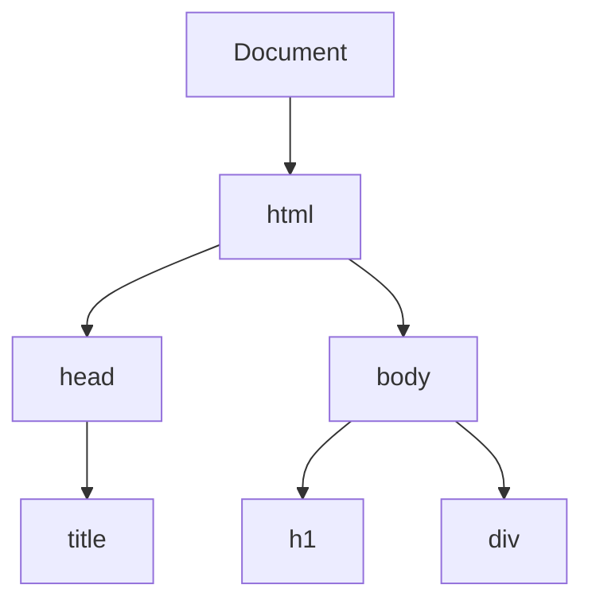

# Événements JavaScript et Manipulation du DOM

---

# Table des Matières

<div class="text-left flex items-center justify-around gap-20 w-full mt-20">
  <div>
    <div class="text-7xl text-center">🔧</div>
    <h3 class="text-xl text-blue-400 font-bold">1. Manipulation du DOM</h3>
    <ul class="mt-2 space-y-1">
      <li>• Structure du DOM</li>
      <li>• Sélection d'éléments</li>
      <li>• Modification d'éléments</li>
      <li>• Création et suppression</li>
    </ul>
  </div>
  <div>
    <div class="text-7xl text-center">🔔</div>
    <h3 class="text-xl text-purple-400 font-bold">2. Événements JavaScript</h3>
    <ul class="mt-2 space-y-1">
      <li>• Types d'événements</li>
      <li>• Gestion des événements</li>
      <li>• Propagation</li>
      <li>• Bonnes pratiques</li>
    </ul>
  </div>
  <div>
    <div class="text-7xl text-center">🎮</div>
    <h3 class="text-xl text-amber-400 font-bold">3. Démo: Game</h3>
    <ul class="mt-2 space-y-1">
      <li>• Règles du jeu</li>
      <li>• Implémentation interactive</li>
      <li>• Démonstration en direct</li>
      <li>• Exploration du code</li>
    </ul>
  </div>
</div>

<div class="absolute bottom-10 w-full flex justify-center">
  <div id="suivez-nous" class="cursor-pointer text-center text-xl text-blue-400 animate-pulse">
    Suivez nous
    <div class="flex justify-center">
      <div class="arrow-down text-3xl">>></div>
    </div>
  </div>
</div>

<script setup>
import { onMounted } from 'vue'

onMounted(() => {
  const suivezNous = document.getElementById('suivez-nous')
  if (suivezNous) {
    suivezNous.addEventListener('click', () => {
      window.dispatchEvent(new KeyboardEvent('keydown', { key: 'ArrowRight' }))
    })
  }
})
</script>

---

# HTML DOM

Lorsqu'une page web est chargée, le navigateur crée DOM (Document Object Model) de la page

<div class="flex justify-center items-center">

</div>

---

## JavaScript obtient toute la puissance nécessaire pour créer du HTML dynamique:

<ul class="list-disc pl-6 space-y-2 text-lg">
  <li class="text-gray-200 hover:text-blue-600 transition-colors">JavaScript peut ajouter de nouveaux éléments et attributs HTML</li>
  <li class="text-gray-200 hover:text-blue-600 transition-colors">JavaScript peut modifier tous les éléments HTML de la page</li>
  <li class="text-gray-200 hover:text-blue-600 transition-colors">JavaScript peut modifier tous les attributs HTML de la page</li>
  <li class="text-gray-200 hover:text-blue-600 transition-colors">JavaScript peut modifier tous les styles CSS de la page</li>
  <li class="text-gray-200 hover:text-blue-600 transition-colors">JavaScript peut supprimer des éléments et des attributs HTML existants</li>
  <li class="text-gray-200 hover:text-blue-600 transition-colors">JavaScript peut créer de nouveaux événements HTML dans la page</li>
  <li class="text-gray-200 hover:text-blue-600 transition-colors">JavaScript peut réagir à tous les événements HTML existants dans la page</li>
</ul>

---

# Trouver des Éléments HTML

<div class="grid grid-cols-2 gap-4">
  <div>
    <h3 class="text-yellow-500 text-xl mb-2">Méthodes de Sélection</h3>
    
```js
// Par ID - retourne un élément unique
const element = document.getElementById('monId');

// Par nom de classe - retourne une HTMLCollection
const elements = document.getElementsByClassName('maClasse');

// Par nom de balise - retourne une HTMLCollection
const paragraphes = document.getElementsByTagName('p');

// Par nom - retourne une NodeList (formulaires)
const inputs = document.getElementsByName('email');
```
  </div>
  
  <div>
    <h3 class="text-yellow-500 text-xl mb-2">Sélecteurs CSS (Modernes)</h3>
    
```js
// Sélectionne le premier élément correspondant
const premier = document.querySelector('.classe');

// Sélectionne tous les éléments correspondants
// Retourne une NodeList
const tous = document.querySelectorAll('p.important');

// Sélecteurs complexes
const elements = document.querySelectorAll(
  'div.container > p:first-child'
);

// Vérifier l'existence d'un élément
if (document.querySelector('.elementSpecial')) {
  // L'élément existe
}
```
  </div>
</div>

---

# Collections HTML et NodeList

<div class="grid grid-cols-2 gap-4">
  <div>
    <h3 class="text-yellow-500 text-xl mb-2">HTMLCollection</h3>
    
```js
// Retourne une HTMLCollection
const divs = document.getElementsByTagName('div');

// Accès par index
const premierDiv = divs[0];

// Accès par ID
const divSpecial = divs.namedItem('divId');

// ⚠️ Collection DYNAMIQUE (mise à jour automatique)
// quand le DOM change
console.log(divs.length); // 5
document.body.appendChild(document.createElement('div'));
console.log(divs.length); // 6 (mise à jour automatique)

// Conversion en tableau pour utiliser les méthodes Array
const tabDivs = Array.from(divs);
tabDivs.forEach(div => div.style.color = 'blue');
```
  </div>
  
  <div>
    <h3 class="text-yellow-500 text-xl mb-2">NodeList</h3>
    
```js
// Retourne une NodeList
const paras = document.querySelectorAll('p');

// Accès par index
const premierPara = paras[0];

// ⚠️ Collection STATIQUE (pas de mise à jour)
console.log(paras.length); // 3
document.body.appendChild(document.createElement('p'));
console.log(paras.length); // Toujours 3 (ne change pas)

// Possède forEach natif (mais pas toutes les méthodes Array)
paras.forEach(para => para.classList.add('texte'));

// Conversion complète en tableau si nécessaire
const tabParas = Array.from(paras);
const filtre = tabParas.filter(p => p.textContent.includes('mot'));
```
  </div>
</div>

---

# Modifier des Éléments HTML

<div class="grid grid-cols-2 gap-4">
  <div>
    <h3 class="text-yellow-500 text-xl mb-2">Contenu et Attributs</h3>
    
```js
// Modifier le contenu HTML
element.innerHTML = '<span>Nouveau contenu</span>';

// Modifier le contenu texte (plus sécurisé)
element.textContent = 'Texte simple';

// Modifier des attributs (méthode 1)
element.setAttribute('class', 'active');
element.setAttribute('href', 'https://exemple.com');

// Modifier des attributs (méthode 2)
element.className = 'active';
element.href = 'https://exemple.com';
```
```html
<a class="active" href="https://exemple.com"></a>
```
  </div>
  
  <div>
    <h3 class="text-yellow-500 text-xl mb-2">Styles et Classes</h3>
    
```js
// Modifier les styles directement
element.style.color = 'red';
element.style.backgroundColor = '#f0f0f0';
element.style.fontSize = '18px';

// Ajouter/supprimer des classes
element.classList.add('actif');
element.classList.remove('inactif');
element.classList.toggle('selectionne');
element.classList.replace('ancien', 'nouveau');

// Vérifier si une classe existe
if (element.classList.contains('important')) {
  // Faire quelque chose
}
```
  </div>
</div>

---

# Ajouter et Supprimer des Éléments

<div class="grid grid-cols-2 gap-4">
  <div>
    <h3 class="text-yellow-500 text-xl mb-2">Créer et Ajouter</h3>
    
```js
// Créer un nouvel élément
const div = document.createElement('div');
const para = document.createElement('p');

// Ajouter à la fin d'un élément parent
document.body.appendChild(div);
parentElement.appendChild(para);

// Insérer avant un élément spécifique
parentElement.insertBefore(nouvelElement, referenceElement);

// Méthodes modernes (meilleur support)
parent.append(element1, element2); // Ajoute à la fin
parent.prepend(element); // Ajoute au début
reference.before(element); // Insère avant
reference.after(element); // Insère après
```
  </div>
  
  <div>
    <h3 class="text-yellow-500 text-xl mb-2">Supprimer et Remplacer</h3>
    
```js
// Supprimer un élément (méthode moderne)
element.remove();

// Supprimer un élément enfant
parent.removeChild(element);

// Remplacer un élément
parent.replaceChild(nouvelElement, ancienElement);

// Méthode moderne pour remplacer
ancienElement.replaceWith(nouvelElement);

// Écrire directement dans le flux HTML (DÉCONSEILLÉ)
// Efface tout le contenu existant !
document.write('<p>Nouveau contenu</p>');
```
</div>
</div>

---

# De la Manipulation du DOM aux Événements

<div class="flex flex-col items-center justify-center h-80">
  <div class="text-5xl font-bold mb-8 bg-gradient-to-r from-blue-400 to-purple-500 text-transparent bg-clip-text">
    Structure ⟹ Interaction
  </div>
  <div class="grid grid-cols-2 gap-8">
    <div class="flex flex-col items-center">
      <div class="text-6xl mb-4">🏗️</div>
      <div class="text-center">
        <div class="text-xl font-semibold text-blue-400">Manipulation du DOM</div>
        <div class="text-sm text-gray-400 mt-2">Création et modification d'éléments</div>
      </div>
    </div>
    <div class="flex flex-col items-center">
      <div class="text-6xl mb-4">🖱️</div>
      <div class="text-center">
        <div class="text-xl font-semibold text-purple-500">Événements</div>
        <div class="text-sm text-gray-400 mt-2">Interactivité et réponse aux actions</div>
      </div>
    </div>
  </div>
</div>

---

# Événements HTML Courants

<div class="grid grid-cols-3 gap-4">
  <div>
    <h3 class="text-yellow-500 text-xl mb-2">Événements Souris</h3>
    <ul class="space-y-1 text-sm">
      <li><code>click</code> - Clic sur l'élément</li>
      <li><code>dblclick</code> - Double clic</li>
      <li><code>mouseover</code> - Souris entre dans l'élément</li>
      <li><code>mouseout</code> - Souris quitte l'élément</li>
      <li><code>mousedown</code> - Bouton souris enfoncé</li>
      <li><code>mouseup</code> - Bouton souris relâché</li>
      <li><code>mousemove</code> - Souris déplacée sur élément</li>
      <li><code>contextmenu</code> - Clic droit (menu contextuel)</li>
    </ul>
  </div>
  
  <div>
    <h3 class="text-yellow-500 text-xl mb-2">Formulaires & Clavier</h3>
    <ul class="space-y-1 text-sm">
      <li><code>submit</code> - Formulaire soumis</li>
      <li><code>reset</code> - Formulaire réinitialisé</li>
      <li><code>focus</code> - Élément reçoit le focus</li>
      <li><code>blur</code> - Élément perd le focus</li>
      <li><code>change</code> - Valeur du champ changée</li>
      <li><code>input</code> - Saisie dans champ de texte</li>
      <li><code>keydown</code> - Touche enfoncée</li>
      <li><code>keyup</code> - Touche relâchée</li>
      <li><code>keypress</code> - Touche pressée (caractère)</li>
      <li><code>select</code> - Texte sélectionné</li>
    </ul>
  </div>
  
  <div>
  <div>
    <h3 class="text-yellow-500 text-xl mb-2">Document & Ressources</h3>
    <ul class="space-y-1 text-sm">
      <li><code>load</code> - Élément chargé</li>
      <li><code>unload</code> - Page déchargée</li>
      <li><code>resize</code> - Fenêtre redimensionnée</li>
      <li><code>scroll</code> - Défilement de la page</li>
      <li><code>error</code> - Erreur de chargement</li>
      <li><code>abort</code> - Chargement interrompu</li>
      <li><code>beforeunload</code> - Avant déchargement</li>
    </ul>
    
  </div>
  <div>
    <h3 class="text-yellow-500 text-xl mb-2 mt-3">Tactile</h3>
    <ul class="space-y-1 text-sm">
      <li><code>ontouchstart</code> - Début toucher</li>
      <li><code>ontouchend</code> - Fin toucher</li>
      <li><code>ontouchmove</code> - Mouvement tactile</li>
    </ul>
  </div>
  </div>
</div>

<div class="mt-4 p-3 rounded-lg text-center text-sm">
  <span class="font-bold">Note:</span> Tous ces événements peuvent être utilisés comme attributs HTML (onclick="...") 
  <br>ou attachés via JavaScript avec addEventListener('click', ...)
</div>

---

# Méthodes de Gestion des Événements

<div class="grid grid-cols-2 gap-4">
  <div>
    <h3 class="text-xl text-yellow-500 mb-2">Méthode 1 : Attributs HTML</h3>
```html
<button onclick="gererClic()">Cliquez-moi</button>
```
    <div class="mt-2 text-red-500">⚠️ Non recommandé - mélange HTML et JS</div>
  </div>
  <div>
    <h3 class="text-xl text-yellow-500 mb-2">Méthode 2 : Propriétés DOM</h3>
```js
const bouton = document.querySelector('button');
bouton.onclick = function() {
  alert('Bouton cliqué !');
};
```
    <div class="mt-2 text-orange-500">⚠️ Limité - un seul gestionnaire par événement</div>
  </div>
</div>

<div class="mt-6">
  <h3 class="text-xl text-yellow-500 mb-2">Méthode 3 : addEventListener (Recommandée)</h3>
```js
const bouton = document.querySelector('button');
bouton.addEventListener('click', function() {
  alert('Premier gestionnaire');
});
bouton.addEventListener('click', function() {
  alert('Deuxième gestionnaire');
});
```
  <div class="mt-2 text-green-500">✓ Gestionnaires multiples, plus de contrôle, séparation plus propre</div>
</div>

---

# Démo : Click

<div class="flex flex-col gap-9 h-full items-center justify-center mt-20">
  <div class="flex h-full items-center">

```js
const bouton = document.getElementById('demo-button');

bouton.addEventListener('click', function() {
  bouton.style.backgroundColor = getRandomColor()
});
```
  </div>
  <button id="demo-button" class="bg-gray-900 border-1 border-blue hover:bg-gray-700 text-white font-bold py-2 px-4 rounded-lg">
    Cliquez-moi
  </button>
</div>

<script setup>
import { onMounted } from 'vue'

onMounted(() => {
  function getRandomColor() {
    var letters = '0123456789ABCDEF';
    var color = '#';
    for (var i = 0; i < 6; i++) {
      color += letters[Math.floor(Math.random() * 16)];
    }
    return color + "A0";
  }
  const bouton = document.getElementById('demo-button');

  bouton.addEventListener('click', function() {
    bouton.style.backgroundColor = getRandomColor()
  });
})
</script>

---

# Démo : Survol de la Souris

<div class="grid grid-cols-2 gap-8 h-full">
  <div class="flex flex-col justify-center pl-4">
    <h3 class="text-yellow-500 text-xl mb-4">Code</h3>
    
  ```js
  const mouse = document.getElementById("mouse");

  mouse.addEventListener("mousemove", (e) => {
    // Récupérer les coordonnées de la souris
    const x = e.clientX;
    const y = e.clientY;
    
    mouse.textContent = `(${x}, ${y})`;
  });
  ```
  </div>
  <div class="flex flex-col justify-center pl-24 pt-10">
    <div id="mouse" class="flex justify-center items-center border-2 border-blue-400 rounded-lg w-52 h-52 text-center bg-gray-800 text-blue-300 font-mono text-xl shadow-lg transition-all duration-300">
      Déplacez le curseur ici
    </div>
  </div>
</div>

<script setup>
import { onMounted } from 'vue'

onMounted(() => {
  const mouse = document.getElementById("mouse")
  mouse.addEventListener("mousemove",(e)=>{
    mouse.textContent = `(${e.clientX}, ${e.clientY})`
  })
})
</script>

---

# Démo : Événements Clavier

<div class="grid grid-cols-2 gap-8 h-full">
  <div class="flex flex-col justify-center items-center mt-9">
    <input id="keyboard-input" class="w-64 p-3 bg-gray-900 border-2 border-blue-400 rounded-lg text-center text-blue-300 font-mono text-xl focus:outline-none focus:border-yellow-400" type="text" placeholder="Cliquez ici d'abord">
    <div id="key-display" class="mt-6 p-4 w-64 h-24 bg-gray-900 border-2 border-green-400 rounded-lg flex items-center justify-center text-green-300 font-mono text-xl">
      Appuyez sur une touche
    </div>
  </div>
  <div class="flex flex-col justify-center pl-4">
    <h3 class="text-yellow-500 text-xl mb-4">Code</h3>
    
```js
const input = document.getElementById("keyboard-input")
const display = document.getElementById("key-display")

input.addEventListener("keydown", (e) => {
  display.textContent = `Touche: ${e.key}\nCode: ${e.code}`
  
  if (e.key === "h") {
    display.textContent = "special"
  }
})
```
  </div>
</div>

<script setup>
import { onMounted } from 'vue'

onMounted(() => {
  const input = document.getElementById("keyboard-input")
  const display = document.getElementById("key-display")
  
  input.addEventListener("keydown", (e) => {
    display.textContent = `Touche: ${e.key}\nCode: ${e.code}`
    
    if (e.key === "h") {
      display.textContent = "special"
    }
  })
})
</script>

---
layout: two-cols
---

# Propagation des Événements

Les événements dans le DOM remontent de l'élément cible jusqu'à la racine.

<div class="mt-4">
  <h3 class="text-yellow-500">Trois Phases :</h3>
  <ol>
    <li>Phase de Capture</li>
    <li>Phase de Cible</li>
    <li>Phase de Bouillonnement</li>
  </ol>
</div>

::right::

<div class="flex items-center justify-center h-full">
  <div class="relative border-4 border-blue-500 p-8 w-64 h-64 rounded-lg">
    <div class="text-center relative bottom-4">Document</div>
    <div class="absolute top-12 left-12 right-12 bottom-12 border-4 border-green-500 rounded-lg p-4">
      <div class="text-center">Parent</div>
      <div class="absolute top-12 left-8 right-8 bottom-8 border-4 border-red-500 rounded-lg flex items-center justify-center">
        <div class="text-center">Cible</div>
      </div>
    </div>
  </div>
</div>

---

# Démo Interactive : Propagation d'Événements

<div class="grid grid-cols-2 gap-8">
  <div>
    <div id="parent" class="border-2 border-blue-200 p-8 rounded-lg relative">
      <div class="text-center mb-4">Élément Parent</div>
      <div id="enfant" class="border-2 border-green-200 p-6 rounded-lg">
        <div class="text-center mb-2">Élément Enfant</div>
        <button id="btn" class="border-2 border-red-500 text-white px-4 py-2 rounded-lg hover:bg-red-500">Cliquez-moi</button>
      </div>
    </div>
    <div id="event-log" class="mt-4 h-32 overflow-y-auto border-2 border-gray-100 p-2 rounded text-white"></div>
  </div>
  <div>
```js
const parent = document.getElementById('parent');
const enfant = document.getElementById('enfant');
const bouton = document.getElementById('btn');
const journal = document.getElementById('event-log');

function enregistrerEvenement(evenement) {
  const entree = document.createElement('div');
  entree.textContent = `${evenement.type} sur ${evenement.currentTarget.id}`;
  journal.prepend(entree);
}

parent.addEventListener('click', enregistrerEvenement);
enfant.addEventListener('click', enregistrerEvenement);
bouton.addEventListener('click', enregistrerEvenement);
```
  </div>
</div>

<script setup>
import { onMounted } from 'vue'

onMounted(() => {
  const parent = document.getElementById('parent')
  const enfant = document.getElementById('enfant')
  const bouton = document.getElementById('btn')
  const journal = document.getElementById('event-log')
  
  if (parent && enfant && bouton && journal) {
    function enregistrerEvenement(evenement) {
      const entree = document.createElement('div')
      entree.textContent = `${evenement.type} sur ${evenement.currentTarget.id}`
      journal.prepend(entree)
    }
    
    parent.addEventListener('click', enregistrerEvenement)
    enfant.addEventListener('click', enregistrerEvenement)
    bouton.addEventListener('click', enregistrerEvenement)
  }
})
</script>

---

# Techniques Avancées d'Événements

<div class="grid grid-cols-2 gap-4">
  <div>
    <h3 class="text-xl text-yellow-500 mb-2">Délégation d'Événements</h3>
```js
document.getElementById('container').addEventListener('click', function(e) {
  if (e.target.matches('button.action')) {
    console.log('Bouton cliqué:', e.target.textContent);
  }
});
```
    <div class="mt-2 text-green-500">✓ Parfait pour les éléments dynamiques</div>
    <h3 class="text-xl text-yellow-500 mb-4 mt-4">Supprimer des Écouteurs</h3>

```js
function handleClick(e) {
  e.currentTarget.removeEventListener('click', handleClick);
}

element.addEventListener('click', handleClick);
```
  </div>
  
  <div>
    <h3 class="text-xl text-yellow-500 mb-2">Options de addEventListener</h3>

```js
element.addEventListener('click', handler, {
  once: true,      // Se déclenche une seule fois puis se supprime
  capture: true,   // Capture pendant la phase descendante
  passive: true    // Indique que preventDefault() ne sera pas appelé
});

element.addEventListener('click', function(e) {
  e.stopPropagation();
});

form.addEventListener('submit', function(e) {
  e.preventDefault(); // Empêche l'envoi du formulaire
});
```
    <div class="mt-2 text-blue-500">ℹ️ L'option 'passive' améliore les performances tactiles</div>
  </div>
</div>

---

# Bonnes Pratiques

<div class="grid grid-cols-2 gap-6">
  <div>
    <h3 class="text-yellow-500 text-xl mb-2">Performance</h3>
    <ul>
      <li>Regroupez les mises à jour DOM quand c'est possible</li>
      <li>Envisagez d'utiliser `requestAnimationFrame` pour les animations</li>
      <li>Évitez le "layout thrashing" (alternance de lectures et écritures)</li>
    </ul>
    <h3 class="text-yellow-500 text-xl mb-2 mt-4">Organisation du Code</h3>
    <ul>
      <li>Séparez la logique de la manipulation DOM</li>
      <li>Utilisez des noms de variables descriptifs</li>
      <li>Commentez les opérations DOM complexes</li>
    </ul>
  </div>
  <div>
    <h3 class="text-yellow-500 text-xl mb-2">Gestion des Erreurs</h3>
    <ul>
      <li>Vérifiez toujours si les éléments existent avant de les manipuler</li>
      <li>Utilisez try/catch pour les opérations DOM risquées</li>
      <li>Validez les saisies utilisateur avant de les traiter</li>
    </ul>
    <h3 class="text-yellow-500 text-xl mb-2 mt-4">Accessibilité</h3>
    <ul>
      <li>Utilisez des éléments HTML sémantiques</li>
      <li>Assurez-vous que la navigation au clavier fonctionne</li>
      <li>Maintenez la gestion du focus</li>
      <li>Ajoutez les attributs ARIA appropriés</li>
      <li>Testez avec des lecteurs d'écran</li>
    </ul>
  </div>
</div>

---
layout: full
--- 

<div class="flex justify-center items-center w-full h-full">
  <div class="text-5xl font-bold mb-8 bg-gradient-to-r from-blue-400 to-purple-500 text-transparent bg-clip-text">
    Conway's Game of Life
  </div>
</div>

---

# Le Jeu de la Vie de Conway

<div>
  <h2 class="text-yellow-500 text-xl mb-2">Les Règles</h2>
  <ul className="space-y-6 text-xl">
    <li className="flex items-start">
      <div id="rule1-demo" class="grid grid-cols-3 gap-0.5 mr-4 bg-gray-800 p-1 rounded">
        <div class="w-3 h-3 bg-gray-700"></div>
        <div class="w-3 h-3 bg-gray-700"></div>
        <div class="w-3 h-3 bg-gray-700"></div>
        <div class="w-3 h-3 bg-gray-700"></div>
        <div class="cell-alive w-3 h-3 bg-amber-400"></div>
        <div class="w-3 h-3 bg-gray-700"></div>
        <div class="w-3 h-3 bg-gray-700"></div>
        <div class="w-3 h-3 bg-gray-700"></div>
        <div class="w-3 h-3 bg-gray-700"></div>
      </div>
      <span className="text-amber-400 text-xl mr-3">1.</span>
      <span className="text-amber-400 text-xl mr-3">Une cellule vivante avec moins de 2 voisines vivantes meurt (sous-population)</span>
    </li>
    <li className="flex items-start">
      <div id="rule2-demo" class="grid grid-cols-3 gap-0.5 mr-4 bg-gray-800 p-1 rounded">
        <div class="w-3 h-3 bg-gray-700"></div>
        <div class="cell-alive w-3 h-3 bg-amber-400"></div>
        <div class="w-3 h-3 bg-gray-700"></div>
        <div class="cell-alive w-3 h-3 bg-amber-400"></div>
        <div class="cell-alive w-3 h-3 bg-amber-400"></div>
        <div class="w-3 h-3 bg-gray-700"></div>
        <div class="w-3 h-3 bg-gray-700"></div>
        <div class="w-3 h-3 bg-gray-700"></div>
        <div class="w-3 h-3 bg-gray-700"></div>
      </div>
      <span className="text-amber-400 text-xl mr-3">2.</span>
      <span className="text-amber-400 text-xl mr-3">Une cellule vivante avec 2 ou 3 voisines vivantes survit</span>
    </li>
    <li className="flex items-start">
      <div id="rule3-demo" class="grid grid-cols-3 gap-0.5 mr-4 bg-gray-800 p-1 rounded">
        <div class="cell-alive w-3 h-3 bg-amber-400"></div>
        <div class="cell-alive w-3 h-3 bg-amber-400"></div>
        <div class="cell-alive w-3 h-3 bg-amber-400"></div>
        <div class="cell-alive w-3 h-3 bg-amber-400"></div>
        <div class="cell-alive w-3 h-3 bg-amber-400"></div>
        <div class="w-3 h-3 bg-gray-700"></div>
        <div class="w-3 h-3 bg-gray-700"></div>
        <div class="w-3 h-3 bg-gray-700"></div>
        <div class="w-3 h-3 bg-gray-700"></div>
      </div>
      <span className="text-amber-400 text-xl mr-3">3.</span>
      <span className="text-amber-400 text-xl mr-3">Une cellule vivante avec plus de 3 voisines vivantes meurt (surpopulation)</span>
    </li>
    <li className="flex items-start">
      <div id="rule4-demo" class="grid grid-cols-3 gap-0.5 mr-4 bg-gray-800 p-1 rounded">
        <div class="w-3 h-3 bg-gray-700"></div>
        <div class="cell-alive w-3 h-3 bg-amber-400"></div>
        <div class="w-3 h-3 bg-gray-700"></div>
        <div class="cell-alive w-3 h-3 bg-amber-400"></div>
        <div class="cell-dead w-3 h-3 bg-gray-700"></div>
        <div class="cell-alive w-3 h-3 bg-amber-400"></div>
        <div class="w-3 h-3 bg-gray-700"></div>
        <div class="w-3 h-3 bg-gray-700"></div>
        <div class="w-3 h-3 bg-gray-700"></div>
      </div>
      <span className="text-amber-400 mr-3">4.</span>
      <span className="text-amber-400 text-xl mr-3">Une cellule morte avec exactement 3 voisines vivantes devient vivante (reproduction)</span>
    </li>
  </ul>
</div>

<script setup>
import { onMounted } from 'vue'

onMounted(() => {
  const rule1Demo = document.getElementById('rule1-demo')
  if (rule1Demo) {
    setInterval(() => {
      const cells = rule1Demo.querySelectorAll('.cell-alive')
      cells.forEach(cell => {
        cell.classList.toggle('bg-amber-400')
        cell.classList.toggle('bg-gray-700')
      })
    }, 1000)
  }
  
  const rule2Demo = document.getElementById('rule2-demo')
  if (rule2Demo) {
    setInterval(() => {
      const centerCell = rule2Demo.querySelectorAll('.cell-alive')[2]
      if (centerCell) {
        centerCell.classList.add('bg-amber-400')
        centerCell.classList.add('scale-110')
        setTimeout(() => {
          centerCell.classList.remove('scale-110')
        }, 500)
      }
    }, 1500)
  }
  
  const rule3Demo = document.getElementById('rule3-demo')
  if (rule3Demo) {
    setInterval(() => {
      const centerCell = rule3Demo.querySelectorAll('.cell-alive')[4]
      if (centerCell) {
        centerCell.classList.toggle('bg-amber-400')
        centerCell.classList.toggle('bg-gray-700')
      }
    }, 1000)
  }
  
  const rule4Demo = document.getElementById('rule4-demo')
  if (rule4Demo) {
    setInterval(() => {
      const deadCell = rule4Demo.querySelector('.cell-dead')
      if (deadCell) {
        deadCell.classList.toggle('bg-gray-700')
        deadCell.classList.toggle('bg-amber-400')
      }
    }, 1000)
  }
})
</script>

---
layout: full
---

<div class="flex flex-col items-center justify-center h-full">
  <div class="text-4xl font-bold mb-4 bg-gradient-to-r from-blue-400 to-purple-500 text-transparent bg-clip-text">
    Résumé
  </div>
  <div class="flex flex-col items-center mt-6">
    
  </div>
  <div class="mt-8 flex flex-col items-center">
    <div class="flex gap-10">
      <a href="https://github.com/username/js-presentation" target="_blank" class="flex items-center text-lg text-gray-300 hover:text-blue-400 transition-colors">
        <div class="mr-2">
          <svg xmlns="http://www.w3.org/2000/svg" width="24" height="24" viewBox="0 0 24 24" fill="currentColor">
            <path d="M12 0c-6.626 0-12 5.373-12 12 0 5.302 3.438 9.8 8.207 11.387.599.111.793-.261.793-.577v-2.234c-3.338.726-4.033-1.416-4.033-1.416-.546-1.387-1.333-1.756-1.333-1.756-1.089-.745.083-.729.083-.729 1.205.084 1.839 1.237 1.839 1.237 1.07 1.834 2.807 1.304 3.492.997.107-.775.418-1.305.762-1.604-2.665-.305-5.467-1.334-5.467-5.931 0-1.311.469-2.381 1.236-3.221-.124-.303-.535-1.524.117-3.176 0 0 1.008-.322 3.301 1.23.957-.266 1.983-.399 3.003-.404 1.02.005 2.047.138 3.006.404 2.291-1.552 3.297-1.23 3.297-1.23.653 1.653.242 2.874.118 3.176.77.84 1.235 1.911 1.235 3.221 0 4.609-2.807 5.624-5.479 5.921.43.372.823 1.102.823 2.222v3.293c0 .319.192.694.801.576 4.765-1.589 8.199-6.086 8.199-11.386 0-6.627-5.373-12-12-12z"/>
          </svg>
        </div>
        <span>Présentation - Source code</span>
      </a>
      <a href="https://github.com/username/game-of-life-js" target="_blank" class="flex items-center text-lg text-gray-300 hover:text-amber-400 transition-colors">
        <div class="mr-2">
          <svg xmlns="http://www.w3.org/2000/svg" width="24" height="24" viewBox="0 0 24 24" fill="currentColor">
            <path d="M12 0c-6.626 0-12 5.373-12 12 0 5.302 3.438 9.8 8.207 11.387.599.111.793-.261.793-.577v-2.234c-3.338.726-4.033-1.416-4.033-1.416-.546-1.387-1.333-1.756-1.333-1.756-1.089-.745.083-.729.083-.729 1.205.084 1.839 1.237 1.839 1.237 1.07 1.834 2.807 1.304 3.492.997.107-.775.418-1.305.762-1.604-2.665-.305-5.467-1.334-5.467-5.931 0-1.311.469-2.381 1.236-3.221-.124-.303-.535-1.524.117-3.176 0 0 1.008-.322 3.301 1.23.957-.266 1.983-.399 3.003-.404 1.02.005 2.047.138 3.006.404 2.291-1.552 3.297-1.23 3.297-1.23.653 1.653.242 2.874.118 3.176.77.84 1.235 1.911 1.235 3.221 0 4.609-2.807 5.624-5.479 5.921.43.372.823 1.102.823 2.222v3.293c0 .319.192.694.801.576 4.765-1.589 8.199-6.086 8.199-11.386 0-6.627-5.373-12-12-12z"/>
          </svg>
        </div>
        <span>Game of Life - Source code</span>
      </a>
    </div>
  </div>
</div>

---
layout: full
---

<div class="flex flex-col items-center justify-center h-full">
  <div class="text-8xl font-bold bg-gradient-to-r from-blue-400 to-purple-500 text-transparent bg-clip-text mb-6">
    Merci
  </div>
  <div class="text-2xl text-gray-400 mt-4">
    Des questions ?
  </div>
  <div class="mt-12 flex gap-8">
    <div class="animate-bounce text-4xl">👨‍💻</div>
    <div class="animate-pulse text-4xl">🚀</div>
    <div class="animate-bounce text-4xl">🎮</div>
  </div>
</div>
